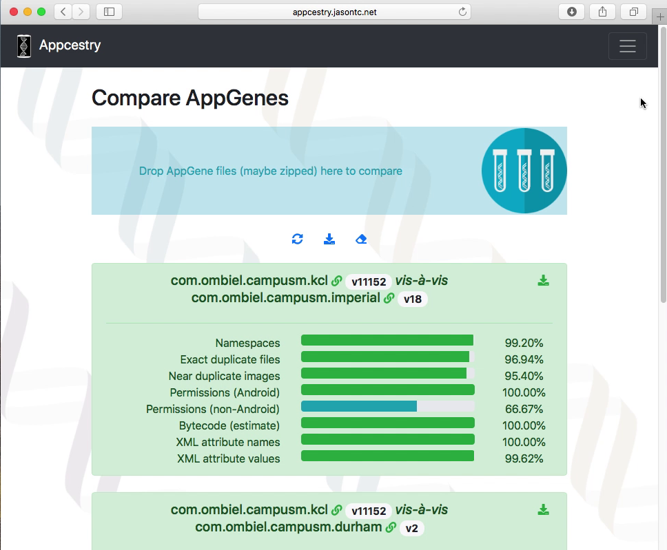
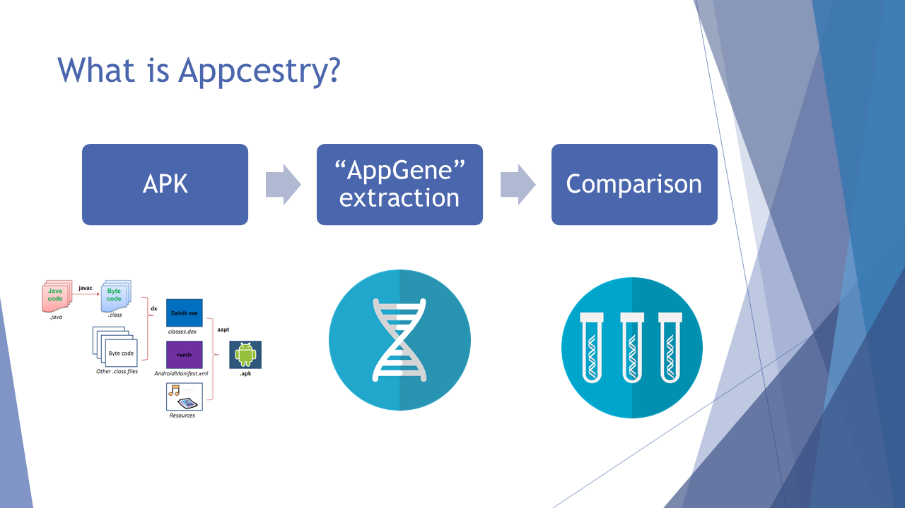

# Appcestry

[](http://appcestry.jasontc.net/)

“Appcestry” (a portmanteau of “app” and “ancestry”) is a tool for the study of similarities of Android applications (apps) started by Jason Chao for his Master of Science in Big Data and Digital Futures dissertation.  The tool extracts features from Android Application PacKages (APK) and transforms them into a format which this project names “AppGenes”.  AppGenes may be used by Appcestry and other machine learning tools to discover similar Android applications.

### Video [https://youtu.be/QLr-cvRAjio](https://youtu.be/QLr-cvRAjio)

### Demo [http://appcestry.jasontc.net/](http://appcestry.jasontc.net/)

### Presentation on how Appcestry works

[](https://www.slideshare.net/TengHeiJasonChao/appcestry-a-tool-for-the-study-of-mobile-application-similarities)

### Full text of the dissertation [DOI 10.13140/RG.2.2.12499.02081](http://dx.doi.org/10.13140/RG.2.2.12499.02081)

## Steps to deploy Appcestry

### Clone the Appcestry repo

```
git clone git@github.com:jason-chao/appcestry.git
```

Alternatively, if you do not wish to clone the repo, you may just download [docker-compose.yml](docker-compose.yml) and [appcestry_cluster.env](appcestry_cluster.env).

### Pull images from Docker registry

```
docker pull jasonthc/appcestry:0.0.1b
docker pull jasonthc/appcestry-frontend:0.0.1b
```

### Use Docker to deploy Appcestry

```
docker stack deploy --compose-file docker-compose.yml appcestry 
```

After deployment, use a browser to open http://localhost:80.  By default, port 80 of the web-frontend container is mapped to port 80 of the host machine.

### Scale the worker nodes in swarm mode

The number '2' is an example only.  It may be changed to a larger number depending on the infrastructure and your need.

```
docker service scale appcestry_dask-worker=2
docker service scale appcestry_rq-worker-compare=2
docker service scale appcestry_rq-worker-convert=2
```
